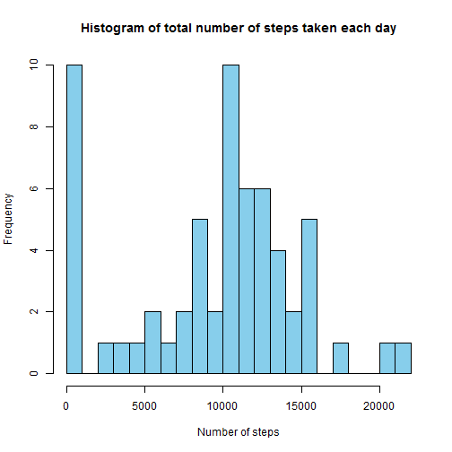

  

This is a R markdown file for project 1.

Instructions:   
1. Loading and preprocessing the data  
2. What is mean total number of steps taken per day?  
3. What is the average daily activity pattern?  
4. Imputing missing values  
5. Are there differences in activity patterns between weekdays and weekends?  

###1. Loading and preprocessing the data

Show any code that is needed to

- Load the data (i.e. read.csv())

- Process/transform the data (if necessary) into a format suitable for your analysis


```r
#load packages
library(dplyr)
library(stringi)
library(ggplot2)
library(Hmisc)
```

rm(list=ls())


```r
setwd("C:/Users/YJ/Desktop/Data Science specialization/C5 Reproducible Research/Proj 1/repdata-data-activity")

activity <- read.csv("activity.csv")
str(activity)
```

```
## 'data.frame':	17568 obs. of  3 variables:
##  $ steps   : int  NA NA NA NA NA NA NA NA NA NA ...
##  $ date    : Factor w/ 61 levels "2012-10-01","2012-10-02",..: 1 1 1 1 1 1 1 1 1 1 ...
##  $ interval: int  0 5 10 15 20 25 30 35 40 45 ...
```

```r
activity.noNA <- na.omit(activity)

#add additional column, change date from 'factor' class to 'date' class 
activity$dDate <- strptime(as.character(activity$date), "%Y-%m-%d") 

#add zeros to the front of the interval column, allow changing to 'time' class
activity$integer = paste0("000", activity$interval, sep = "")

#extract last characters (stringi package)
activity$hr<- stri_sub(activity$integer,-4,-3)
activity$min<- stri_sub(activity$integer,-2,-1)
activity$Time<- paste(activity$hr, activity$min, sep=":")

#combines date and time together
activity<- within(activity, { DateTime=format(as.POSIXlt(paste(dDate, Time)), "%Y-%m-%d %M:%S") })

head(activity)
```

```
##   steps       date interval      dDate integer hr min  Time
## 1    NA 2012-10-01        0 2012-10-01    0000 00  00 00:00
## 2    NA 2012-10-01        5 2012-10-01    0005 00  05 00:05
## 3    NA 2012-10-01       10 2012-10-01   00010 00  10 00:10
## 4    NA 2012-10-01       15 2012-10-01   00015 00  15 00:15
## 5    NA 2012-10-01       20 2012-10-01   00020 00  20 00:20
## 6    NA 2012-10-01       25 2012-10-01   00025 00  25 00:25
##           DateTime
## 1 2012-10-01 00:00
## 2 2012-10-01 05:00
## 3 2012-10-01 10:00
## 4 2012-10-01 15:00
## 5 2012-10-01 20:00
## 6 2012-10-01 25:00
```

```r
str(activity)
```

```
## 'data.frame':	17568 obs. of  9 variables:
##  $ steps   : int  NA NA NA NA NA NA NA NA NA NA ...
##  $ date    : Factor w/ 61 levels "2012-10-01","2012-10-02",..: 1 1 1 1 1 1 1 1 1 1 ...
##  $ interval: int  0 5 10 15 20 25 30 35 40 45 ...
##  $ dDate   : POSIXlt, format: "2012-10-01" "2012-10-01" ...
##  $ integer : chr  "0000" "0005" "00010" "00015" ...
##  $ hr      : chr  "00" "00" "00" "00" ...
##  $ min     : chr  "00" "05" "10" "15" ...
##  $ Time    : chr  "00:00" "00:05" "00:10" "00:15" ...
##  $ DateTime: chr  "2012-10-01 00:00" "2012-10-01 05:00" "2012-10-01 10:00" "2012-10-01 15:00" ...
```

```r
#cleanup
activity$integer <- NULL
activity$hr <- NULL
activity$min <- NULL
activity$dDate <- NULL

head(activity)
```

```
##   steps       date interval  Time         DateTime
## 1    NA 2012-10-01        0 00:00 2012-10-01 00:00
## 2    NA 2012-10-01        5 00:05 2012-10-01 05:00
## 3    NA 2012-10-01       10 00:10 2012-10-01 10:00
## 4    NA 2012-10-01       15 00:15 2012-10-01 15:00
## 5    NA 2012-10-01       20 00:20 2012-10-01 20:00
## 6    NA 2012-10-01       25 00:25 2012-10-01 25:00
```

###2. What is mean total number of steps taken per day?

For this part of the assignment, you can ignore the missing values in the dataset.

- Calculate the total number of steps taken per day

- If you do not understand the difference between a histogram and a barplot, research the difference between them. Make a histogram of the total number of steps taken each day

- Calculate and report the mean and median of the total number of steps taken per day


```r
#calculate means for each day
mean<- activity %>% group_by(date) %>% summarise(ave.steps = sum(steps, na.rm=T))
hist(mean$ave, main ="Histogram of total number of steps taken each day", xlab = "Number of steps", col="skyblue",breaks=20)
```

 

```r
meansteps <- mean(mean$ave.steps, na.rm=T)
meansteps
```

```
## [1] 9354.23
```

```r
mediansteps <- median(mean$ave.steps, na.rm=T)
mediansteps
```

```
## [1] 10395
```

#####The mean is **9354.2295082** and median is **10395**. 

###3. What is the average daily activity pattern?
-Make a time series plot (i.e. type = "l") of the 5-minute interval (x-axis) and the average number of steps taken, averaged across all days (y-axis)

-Which 5-minute interval, on average across all the days in the dataset, contains the maximum number of steps?


```r
#calculate means for each interval
ave.daily<- activity %>% group_by(interval) %>% summarise(ave.steps = mean(steps, na.rm=T))
ave.daily
```

```
## Source: local data frame [288 x 2]
## 
##    interval ave.steps
## 1         0 1.7169811
## 2         5 0.3396226
## 3        10 0.1320755
## 4        15 0.1509434
## 5        20 0.0754717
## 6        25 2.0943396
## 7        30 0.5283019
## 8        35 0.8679245
## 9        40 0.0000000
## 10       45 1.4716981
## ..      ...       ...
```

```r
plot(ave.daily, type = "l", main = "Average numbe of steps taken at each time interval", ylab= "average number of steps", xlab = "Time", col ="blue")
```

 

```r
#arrange data frame in descending order of steps 
highest.steps<- arrange(ave.daily, desc(ave.steps))
highest.steps[[1,1]]
```

```
## [1] 835
```

#####The maximum number of steps occurred during **835h**.   
    
###4. Imputing missing values  
Note that there are a number of days/intervals where there are missing values (coded as NA). The presence of missing days may introduce bias into some calculations or summaries of the data.

-Calculate and report the total number of missing values in the dataset (i.e. the total number of rows with NAs)

-Devise a strategy for filling in all of the missing values in the dataset. The strategy does not need to be sophisticated. For example, you could use the mean/median for that day, or the mean for that 5-minute interval, etc.

-Create a new dataset that is equal to the original dataset but with the missing data filled in.

-Make a histogram of the total number of steps taken each day and Calculate and report the mean and median total number of steps taken per day. Do these values differ from the estimates from the first part of the assignment? What is the impact of imputing missing data on the estimates of the total daily number of steps?


```r
missing.values<-table(is.na(activity))

missing.values[[2]]
```

```
## [1] 2304
```

#####The total number of missing values is **2304**.


```r
#To fill in the missing values, I'll use mean steps for a five-minute interval for the entire dataset.


activity.Imputed <- activity.noNA
activity.Imputed$steps <- impute(activity.noNA$steps, fun=mean)

#Let's compare the mean and median steps for each day between the original data set and the imputed data set.

mean2<- activity.Imputed %>% group_by(date) %>% summarise(ave.steps = sum(steps, na.rm=T))


hist(mean2$ave.steps, main ="Without NAs", xlab = "Number of steps", col="skyblue",breaks=20)
```

 

```r
meansteps2 <- mean(mean2$ave.steps, na.rm=T)
meansteps2
```

```
## [1] 10766.19
```

```r
mediansteps2 <- median(mean2$ave.steps, na.rm=T)
mediansteps2
```

```
## [1] 10765
```
#####The new mean is 1.0766189 &times; 10<sup>4</sup> and median is 10765. Imputing missing data overestimates both the mean and median.

###5. Are there differences in activity patterns between weekdays and weekends?  
For this part the weekdays() function may be of some help here. Use the dataset with the filled-in missing values for this part.

- Create a new factor variable in the dataset with two levels - "weekday" and "weekend" indicating whether a given date is a weekday or weekend day.

- Make a panel plot containing a time series plot (i.e. type = "l") of the 5-minute interval (x-axis) and the average number of steps taken, averaged across all weekday days or weekend days (y-axis). See the README file in the GitHub repository to see an example of what this plot should look like using simulated data.


```r
activity$dDate <- strptime(as.character(activity$date), "%Y-%m-%d")
activity$weekdays <- factor(format(activity$dDate, "%A"))

head(activity)
```

```
##   steps       date interval  Time         DateTime      dDate weekdays
## 1    NA 2012-10-01        0 00:00 2012-10-01 00:00 2012-10-01   Monday
## 2    NA 2012-10-01        5 00:05 2012-10-01 05:00 2012-10-01   Monday
## 3    NA 2012-10-01       10 00:10 2012-10-01 10:00 2012-10-01   Monday
## 4    NA 2012-10-01       15 00:15 2012-10-01 15:00 2012-10-01   Monday
## 5    NA 2012-10-01       20 00:20 2012-10-01 20:00 2012-10-01   Monday
## 6    NA 2012-10-01       25 00:25 2012-10-01 25:00 2012-10-01   Monday
```

```r
str(activity)
```

```
## 'data.frame':	17568 obs. of  7 variables:
##  $ steps   : int  NA NA NA NA NA NA NA NA NA NA ...
##  $ date    : Factor w/ 61 levels "2012-10-01","2012-10-02",..: 1 1 1 1 1 1 1 1 1 1 ...
##  $ interval: int  0 5 10 15 20 25 30 35 40 45 ...
##  $ Time    : chr  "00:00" "00:05" "00:10" "00:15" ...
##  $ DateTime: chr  "2012-10-01 00:00" "2012-10-01 05:00" "2012-10-01 10:00" "2012-10-01 15:00" ...
##  $ dDate   : POSIXlt, format: "2012-10-01" "2012-10-01" ...
##  $ weekdays: Factor w/ 7 levels "Friday","Monday",..: 2 2 2 2 2 2 2 2 2 2 ...
```

```r
levels(activity$weekdays)
```

```
## [1] "Friday"    "Monday"    "Saturday"  "Sunday"    "Thursday"  "Tuesday"  
## [7] "Wednesday"
```

```r
levels(activity$weekdays) <- list(weekday = c("Monday", "Tuesday",
                                             "Wednesday", 
                                             "Thursday", "Friday"),
                                 weekend = c("Saturday", "Sunday"))
levels(activity$weekdays)
```

```
## [1] "weekday" "weekend"
```

```r
activity$dDate <- NULL

ave.daily2<- activity %>% group_by(interval,weekdays) %>% summarise(ave.steps = mean(steps, na.rm=T))
ave.daily2
```

```
## Source: local data frame [576 x 3]
## Groups: interval
## 
##    interval weekdays ave.steps
## 1         0  weekday 2.3333333
## 2         0  weekend 0.0000000
## 3         5  weekday 0.4615385
## 4         5  weekend 0.0000000
## 5        10  weekday 0.1794872
## 6        10  weekend 0.0000000
## 7        15  weekday 0.2051282
## 8        15  weekend 0.0000000
## 9        20  weekday 0.1025641
## 10       20  weekend 0.0000000
## ..      ...      ...       ...
```

```r
ggplot(ave.daily2, aes(interval, ave.steps)) +
    geom_line() + facet_grid(weekdays~.) +
    xlab("Time") + 
    ylab("Avarage number of steps")
```

 
